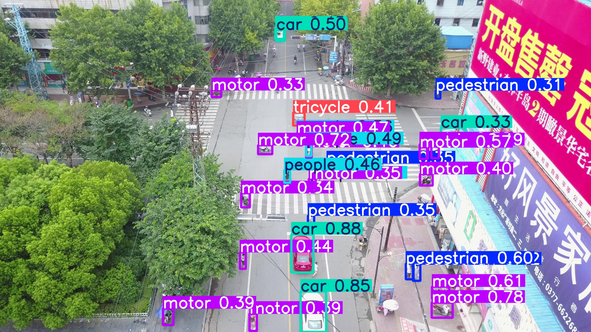
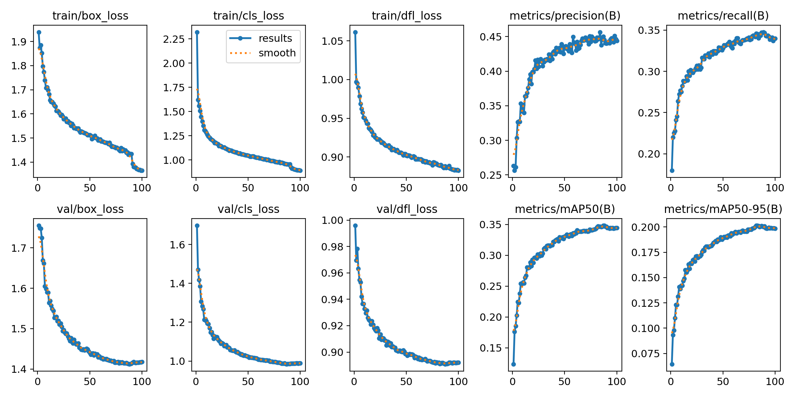
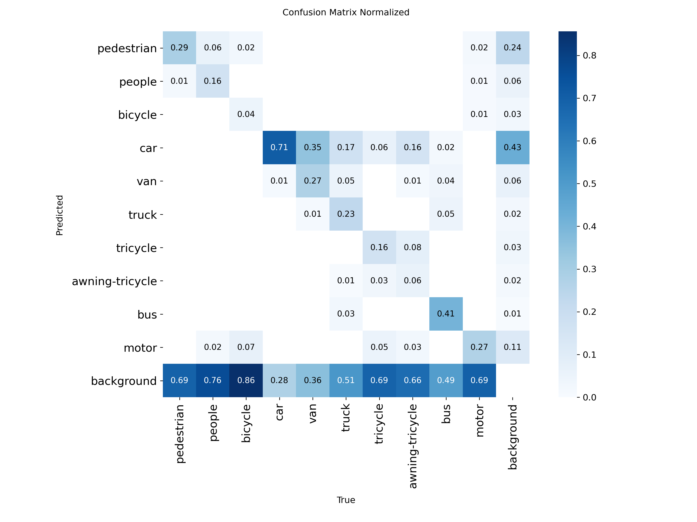

#  VisDrone Object Detection with YOLOv8

Real-time object detection for drone/aerial imagery using YOLOv8-nano trained on the VisDrone2024 dataset.

[](https://huggingface.co/spaces/YOUR_USERNAME/visdrone-detection)
[](https://github.com/YOUR_USERNAME/visdrone-detection)



##  Overview

This project fine-tunes YOLOv8-nano for detecting vehicles, pedestrians, and other objects in drone footage. Trained on 6,471 aerial images from VisDrone2024, the model achieves **43.5% mAP@50** with **56.3% precision** at standard deployment settings.

### Key Features
-  Real-time inference on drone imagery
-  10 object classes (vehicles, pedestrians, bicycles)
-  Lightweight model (6MB) for edge deployment
-  Interactive Gradio demo with adjustable confidence
-  Comprehensive training analysis and documentation

## 🚀 Quick Start

### Try the Demo
 **[Live Demo on Hugging Face Spaces](https://huggingface.co/spaces/YOUR_USERNAME/visdrone-detection)**

### Run Locally
```bash
# Clone repository
git clone https://github.com/YOUR_USERNAME/visdrone-detection.git
cd visdrone-detection

# Install dependencies
pip install -r requirements.txt

# Run demo
cd demo
python app.py
```

Open `http://localhost:7860` in your browser.

##  Performance

### Deployment Metrics (conf=0.25)
| Metric | Value | Description |
|--------|-------|-------------|
| **mAP@50** | **43.5%** | Mean Average Precision at IoU 0.5 |
| **mAP@50-95** | **27.9%** | mAP across IoU thresholds 0.5-0.95 |
| **Precision** | **56.3%** | Ratio of correct detections |
| **Recall** | **29.7%** | Ratio of objects found |

### Standard Evaluation (comparable to papers)
| Metric | Value |
|--------|-------|
| mAP@50 | 34.4% |
| mAP@50-95 | 19.9% |

### Per-Class Performance
| Class | Accuracy | Notes |
|-------|----------|-------|
| Car | **74%** | Best performing |
| Bus | 43% | Distinctive shape helps |
| Motor | 31% | Small but common |
| Pedestrian | 33% | Challenging (small objects) |
| Bicycle | 6% | Very small, rare class |


*Training loss and mAP progression over 100 epochs*


*Normalized confusion matrix showing per-class performance*

##  Key Findings

### What Works Well
-  **Large objects** (cars, buses) detected reliably
-  **No overfitting** - train/val losses track closely
-  **Stable training** - smooth convergence in ~70 epochs

### Challenges Identified
1. **Small object detection** - 64% of pedestrians missed as background
   - Objects <20 pixels lack sufficient features
   - Solution: Larger input resolution (1280px) or YOLOv8s/m

2. **Class confusion** - Cars ↔ Vans (39% confusion rate)
   - Aerial view makes similar vehicles hard to distinguish
   - Solution: Better features or domain-specific augmentation

3. **Crowded scenes** - Occlusion causes false negatives
   - Overlapping objects challenge the model
   - Solution: Copy-paste augmentation, better NMS tuning

### Confidence Threshold Analysis
| Threshold | Precision | Recall | Use Case |
|-----------|-----------|--------|----------|
| 0.10 | 46.3% | 35.6% | Maximum detection |
| **0.15** | 44.3% | **36.6%** | **Balanced** |
| 0.20 | 50.9% | 32.9% | Fewer false positives |
| **0.25** | **56.3%** | 29.7% | **High precision** (default) |
| 0.30 | 56.3% | 29.7% | Critical applications |

## Technical Details

### Dataset
- **Source:** [VisDrone2024-DET](http://aiskyeye.com/)
- **Training:** 6,471 images with 10 object classes
- **Validation:** 548 images
- **Challenges:** Small objects (10-30px), crowding, occlusion

### Model Architecture
- **Base:** YOLOv8-nano (pre-trained on COCO)
- **Input size:** 640×640
- **Parameters:** ~3.2M
- **Model size:** 6.2MB
- **Inference:** ~30ms on GTX 1650

### Training Configuration
```python
Epochs: 100 (early stopping at epoch 84)
Batch size: 8
Optimizer: SGD (momentum=0.937)
Learning rate: 0.01 → 0.001 (cosine decay)
Augmentation: Mosaic, HSV, Flip
Hardware: NVIDIA GTX 1650 (4GB)
Training time: ~16 hours
```

```

##  Reproduce Results

### 1. Download Dataset
```bash
# Download from http://aiskyeye.com/download/object-detection-2/
# - VisDrone2024-DET-train.zip
# - VisDrone2024-DET-val.zip

# Extract to data/ folder
unzip VisDrone2024-DET-train.zip -d data/
unzip VisDrone2024-DET-val.zip -d data/
```

### 2. Convert to YOLO Format
```bash
python src/convert_visdrone_to_yolo.py
```

### 3. Train Model
```bash
python src/train.py
```

### 4. Run Demo
```bash
cd demo
python app.py
```

## Future Improvements

- [ ] **Larger input size** (1280×1280) for small object detection
- [ ] **YOLOv8s/m** for better feature extraction (+5-8% mAP expected)
- [ ] **Multi-scale training** to handle varying object sizes
- [ ] **Test-time augmentation** for robust predictions


If you found this project helpful, please consider giving it a star!